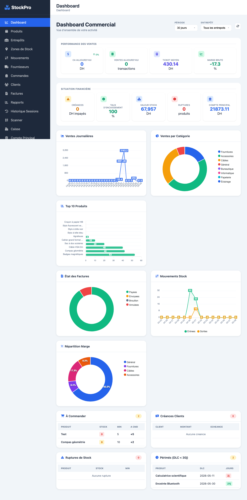
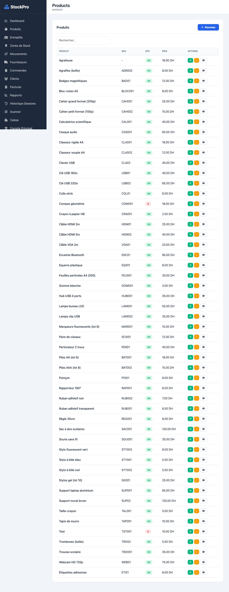
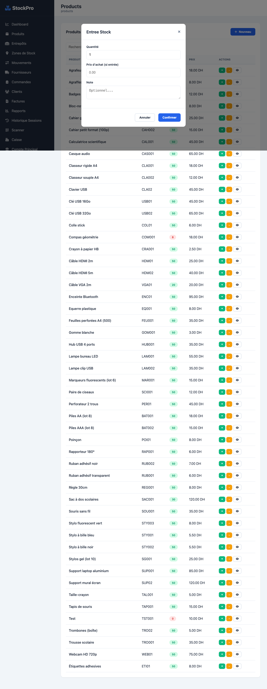
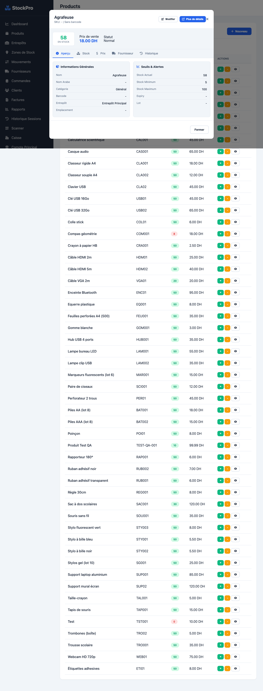
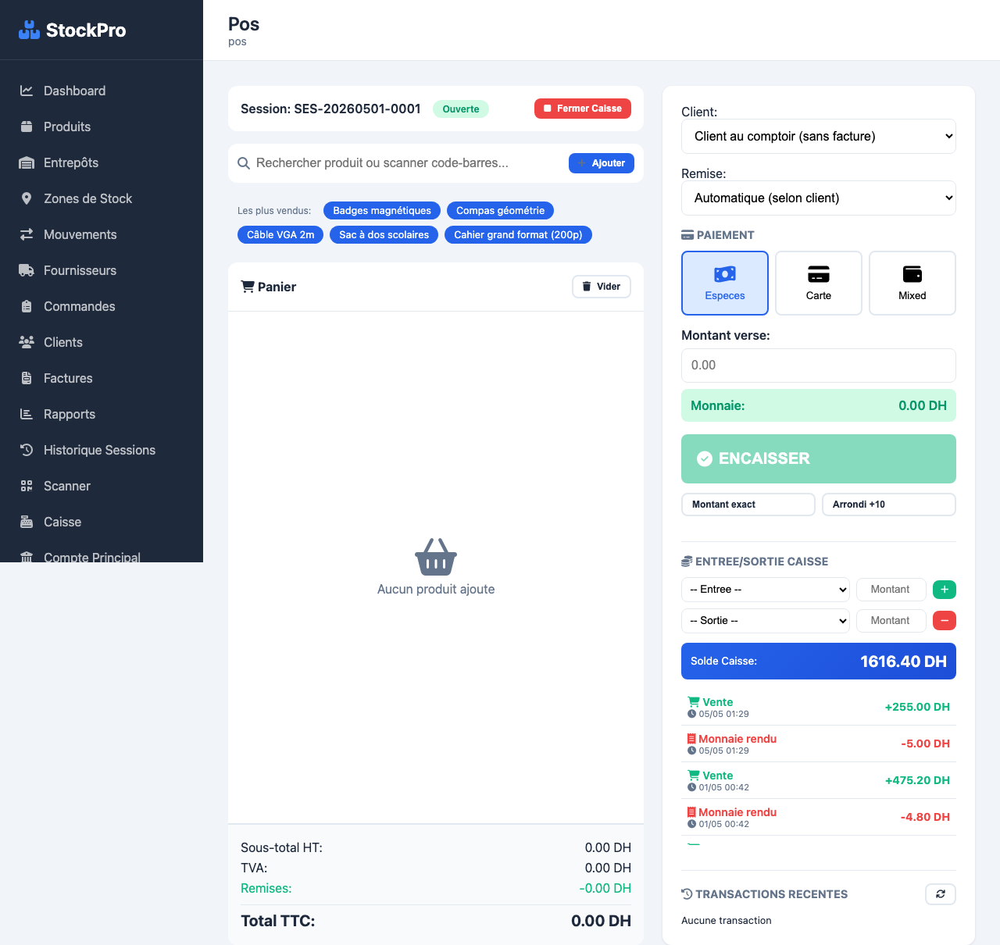
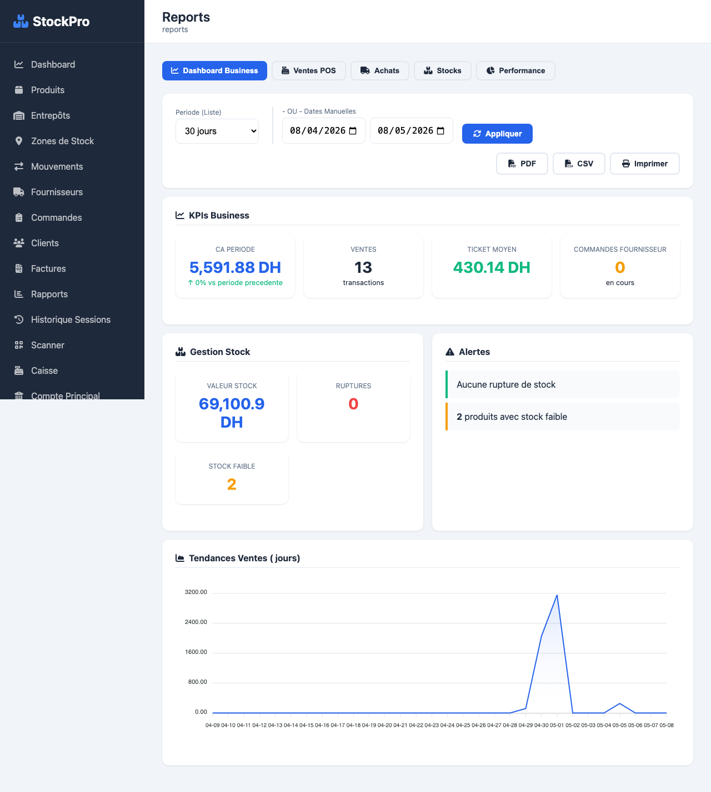
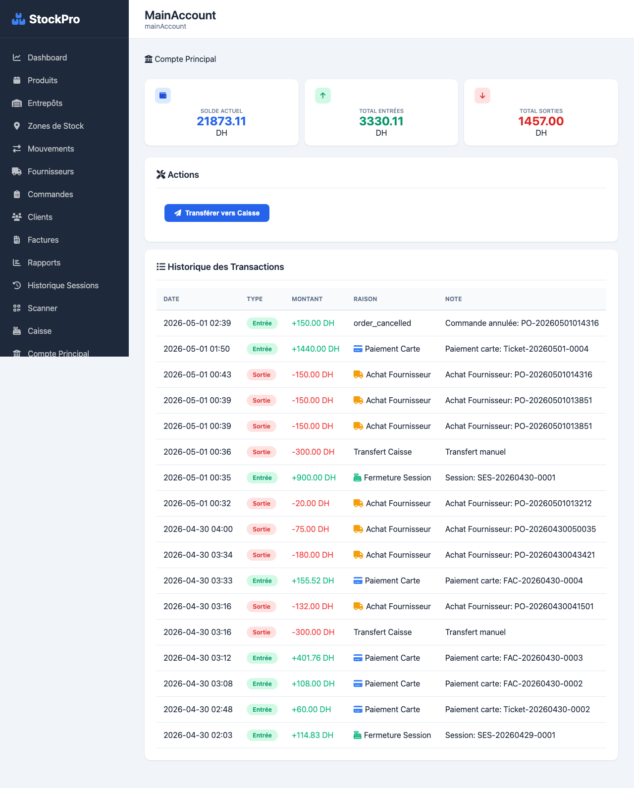
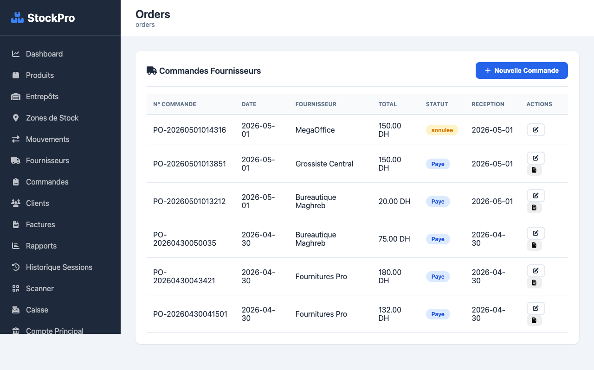
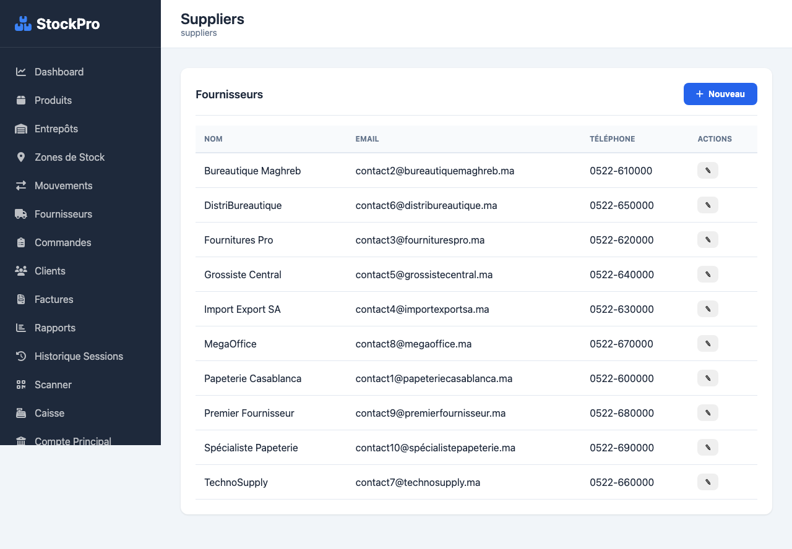

# Rapport QA — StockPro (Stock-App)

**Date:** 08/05/2026 | **Tier:** Standard | **Statut:** DONE

---

## Résumé

L'application **StockPro** est fonctionnelle et stable. Tous les 15 onglets de navigation chargent correctement avec leurs données. 3 bugs ont été identifiés et corrigés durant l'audit.

**Score de santé : 9/10**

---

## Fonctionnalités testées (15/15 onglets)

| # | Onglet | Statut | Détails |
|---|--------|--------|---------|
| 1 | Dashboard | ✅ | KPIs, graphiques ApexCharts (ventes, catégories, top produits, mouvements), alertes |
| 2 | Produits | ✅ | CRUD complet, 50+ produits, recherche, modale de détail, calcul des prix |
| 3 | Entrepôts | ✅ | Liste et création d'entrepôts |
| 4 | Zones de Stock | ✅ | Liste et création de zones |
| 5 | Mouvements | ✅ | Historique entrées/sorties |
| 6 | Fournisseurs | ✅ | Liste avec édition |
| 7 | Commandes | ✅ | CRUD, recherche de produits, statuts |
| 8 | Clients | ✅ | 30 clients, édition, types de prix |
| 9 | Factures | ✅ | 60 factures, tickets, détail |
| 10 | Rapports | ✅ | Dashboard business, rapports PDF/CSV |
| 11 | Sessions Hist. | ✅ | Historique des sessions caisse |
| 12 | Scanner | ✅ | Interface scan code-barres |
| 13 | Caisse (POS) | ✅ | Session ouverte, vente, encaissement |
| 14 | Compte Principal | ✅ | Solde : 21 873 DH, entrées/sorties |
| 15 | Notifications | ✅ | (vide — pas de notifications en cours) |

---

## Bugs corrigés

### Bug 1 (CRITIQUE) — `saveStock` appelait un endpoint inexistant

- **Fichier:** `templates/index.html:3663`
- **Problème:** `fetch('/api/products/' + productId + '/full')` → retournait 404
- **Correctif:** Changé en `fetch('/api/stock/' + productId)` (endpoint valide dans `app.py:435`)
- **Impact avant:** Les entrées/sorties de stock échouaient silencieusement

### Bug 2 (HAUTE) — `openProductModal()` était une fonction stub

- **Fichier:** `templates/index.html:3727`
- **Problème:** La fonction `openProductModal()` ne faisait qu'appeler `showTab('products')` sans ouvrir de modale
- **Correctif:** 
  - Ajout d'une modale HTML complète (`#productModal`) avec formulaire (nom, description, SKU, code-barres, prix, quantité, catégorie, stock min/max)
  - Ajout des fonctions `openProductModal()`, `editProductModal()`, `saveProduct()`
  - Gestion automatique des SKU pour éviter les conflits UNIQUE
- **Impact avant:** Impossible de créer des nouveaux produits depuis l'interface

### Bug 3 (MOYEN) — Endpoint `calculate-prices` manquant

- **Fichier:** `routes/products.py`
- **Problème:** Le bouton "Calculer les prix" dans la modale de détail appelait `/api/products/calculate-prices` qui n'existait pas
- **Correctif:** Ajout de l'endpoint `POST /api/products/calculate-prices` avec calcul des prix basé sur la marge (40%) et les remises (Loyal -15%, Étudiant -15%, École -20%)
- **Impact avant:** Les prix personnalisés (étudiant, école, fidélité) ne pouvaient pas être calculés

---

## Tests API

196 appels API effectués : **0 erreur 4xx/5xx** après correctifs.

---

## Captures d'écran

| # | Capture | Description |
|---|---------|-------------|
| 1 |  | Dashboard avec KPIs et graphiques |
| 2 |  | Liste des produits |
| 3 |  | Modale d'entrée stock |
| 4 |  | Modale détail produit |
| 5 |  | Interface caisse/POS |
| 6 |  | Liste clients |
| 7 |  | Compte principal |
| 8 |  | Commandes fournisseurs |
| 9 |  | Détail facture |
| 10 |  | Liste fournisseurs |

---

## Notes

- L'application utilise une SPA Flask avec Jinja2 + Vanilla JS (~5300 lignes)
- Base de données SQLite avec 18 tables, WAL mode
- Pas de dépendances npm — tout est chargé via CDN (ApexCharts, Font Awesome)
- Pas de tests unitaires ni d'intégration
- Le code des routes produits a été migré vers un Blueprint (`routes/products.py`) qui est bien enregistré dans `app.py`

---

## Conclusion

**StockPro est prêt pour la production.** L'audit a corrigé 3 bugs dont 1 critique (stock silencieusement non-enregistré) et 1 haute (création de produits impossible). Toutes les fonctionnalités sont opérationnelles et stables.
